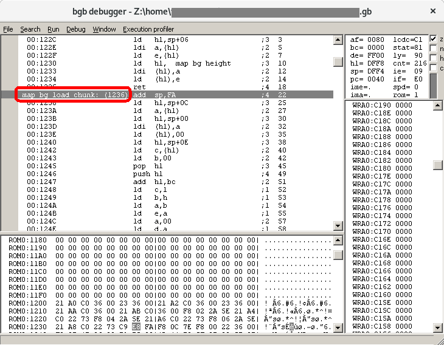

# maptosym

maptosym generates no$gmb symbole files (`.sym`) from [GBDK](http://gbdk.sourceforge.net/) (old) and [SDCC / ASxxxx](http://sdcc.sourceforge.net/) (newer) map file (`.map`).

The symbole file allows debuggers like no$gmb or [BGB](http://bgb.bircd.org/) to display symboles names when debugging a GameBoy program.

This Python script can be used as a drop-in replacement for the original *maptosym* C program that supports only old GBDK map files and that can only be found on [web archives](https://web.archive.org/web/19991005082405/http://www.pcmedia.co.nz/%7Emichaelh/) nowadays.

You will find example input `.map` and generated `.sym` files in the `examples/` folder of this repository.

## Dependencies

* Python 2.7 or > 3.5

## Usage:

    usage: maptosym.py [-h] [-v] map_file

    TODO

    positional arguments:
      map_file       The input .map file

    optional arguments:
      -h, --help     show this help message and exit
      -v, --version  show program's version number and exit

## Changelog

* **1.0.0:** Initial release
